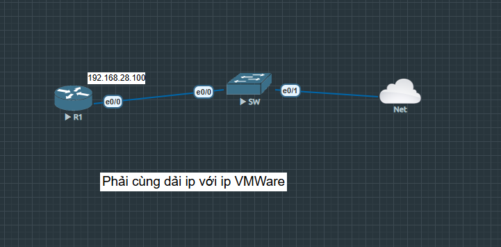

# 🐍 Network Automation - Auto Get Interface Device

> **Language:** Python 3 | **Library:** Netmiko  
> **Mô hình:** Kết nối SSH từ máy tính vào Router Cisco để quản lý tự động

---

## 📐 Topology



```
[Máy tính Python] --> SSH --> [R1: 192.168.28.100] -- e0/0 -- [SW] -- e0/1 -- [Net]

Lưu ý: IP máy tính phải cùng dải với IP VMware (192.168.28.x)
```

---

## 🔧 Tính năng

| Chức năng | Mô tả |
|-----------|-------|
| **Show ip interface brief** | Xem trạng thái các interface |
| **Show version** | Xem thông tin phần mềm IOS |
| **Show running-config (interfaces)** | Xem cấu hình các interface |
| **Backup running-config** | Lưu cấu hình ra file .txt |
| **Ping từ Router** | Gửi lệnh ping từ Router đến địa chỉ bất kỳ |
| **Ping từ máy tính** | Gửi lệnh ping từ máy tính local |

---

## ⚙️ Cấu hình Router trước khi chạy

```bash
! Tạo user SSH trên Router
R1(config)#username python privilege 15 secret cisco

! Bật SSH
R1(config)#ip domain-name lab.local
R1(config)#crypto key generate rsa modulus 1024
R1(config)#ip ssh version 2
R1(config)#line vty 0 4
R1(config-line)#login local
R1(config-line)#transport input ssh

! Đặt enable secret
R1(config)#enable secret cisco
```

---

## 📦 Cài đặt thư viện

```bash
pip install netmiko
```

---

## 🚀 Chạy chương trình

```bash
python AutoGet_Interface_device.py
```

### Giao diện menu:
```
========== NETWORK TOOL ==========
----------------------------------
1.  Show ip interface brief
2.  Show version
3.  Show running-config (interfaces)
4.  Backup running-config ra file
5.  Ping tu ROUTER toi 1 dia chi
6.  Ping tu MAY TINH toi 1 dia chi
7.  Thoat
Chon chuc nang (1-7):
```

---


## 📁 File trong repo

| File | Mô tả |
|------|-------|
| `AutoGet_Interface_device.py` | Script Python chính |
| `Demo_Automation.png` | Sơ đồ topology |
| `backup_running_config_192.168.28.100.txt` | File backup sinh ra sau khi chạy chức năng 4 |

---

## 💡 Điểm nổi bật / Xử lý sự cố

- Máy tính phải **cùng dải IP với VMware** (192.168.28.x) mới SSH được vào Router
- Chức năng ping từ máy tính dùng `subprocess` → chạy lệnh `ping` của Windows (`-n 4`)
- Backup config tự động tạo file tên theo IP Router: `backup_running_config_<IP>.txt`
