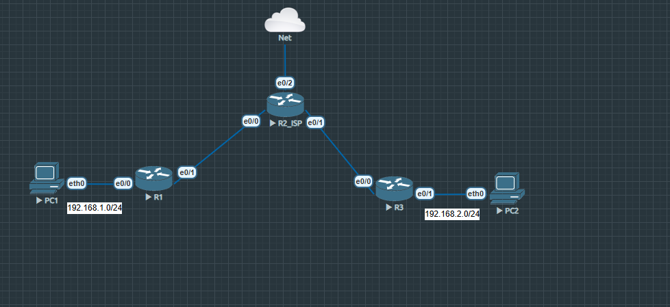

# 🔐 Triển khai VPN IPSec Site-to-Site

> **Platform:** EVE-NG | **Vendor:** Cisco IOS  
> **Mô hình:** 2 Site kết nối qua môi trường Internet giả lập  
> **2 phương pháp:** ACL-based (Policy-based) & Route-based (VTI)

---

## 📐 Topology




---

## 🌐 Quy hoạch địa chỉ IP

| Thiết bị | Interface | IP | Mô tả |
|---------|-----------|-----|-------|
| PC1 | eth0 | 192.168.1.x | LAN Site 1 |
| R1 | e0/0 | 192.168.1.1 | Gateway Site 1 |
| R1 | e0/1 | 10.1.2.1 | WAN về ISP |
| R2_ISP | e0/0 | 10.1.2.2 | ISP phía R1 |
| R2_ISP | e0/1 | 10.2.3.2 | ISP phía R3 |
| R3 | e0/0 | 10.2.3.1 | WAN về ISP |
| R3 | e0/1 | 192.168.2.1 | Gateway Site 2 |
| PC2 | eth0 | 192.168.2.x | LAN Site 2 |

---

## ⚙️ Cách 1: ACL-based (Policy-based) VPN

Traffic cần mã hóa được định nghĩa bằng ACL. Crypto map áp trực tiếp lên WAN interface.

### R1
```bash
! Interesting Traffic
ip access-list extended ACL_VPN
  permit ip 192.168.1.0 0.0.0.255 192.168.2.0 0.0.0.255

! IKE Phase 1
crypto isakmp policy 1
  encryption 3des
  hash md5
  authentication pre-share
  group 2

crypto isakmp key testkey123 address 10.2.3.1

! IKE Phase 2
crypto ipsec transform-set TS esp-3des esp-md5-hmac

! Crypto Map
crypto map MAP 1 ipsec-isakmp
  set peer 10.2.3.1
  set transform-set TS
  match address ACL_VPN

! Áp lên WAN interface
interface e0/1
  crypto map MAP

! Static route
ip route 192.168.2.0 255.255.255.0 10.1.2.2
```

### R3
```bash
ip access-list extended ACL_VPN
  permit ip 192.168.2.0 0.0.0.255 192.168.1.0 0.0.0.255

crypto isakmp policy 1
  encryption 3des
  hash md5
  authentication pre-share
  group 2

crypto isakmp key testkey123 address 10.1.2.1

crypto ipsec transform-set TS esp-3des esp-md5-hmac

crypto map MAP 1 ipsec-isakmp
  set peer 10.1.2.1
  set transform-set TS
  match address ACL_VPN

interface e0/0
  crypto map MAP

ip route 192.168.1.0 255.255.255.0 10.2.3.2
```

---

## ⚙️ Cách 2: Route-based VPN (VTI - Virtual Tunnel Interface)

Tạo interface tunnel ảo, dùng routing để đẩy traffic vào tunnel. Linh hoạt hơn, dễ kết hợp dynamic routing.

### R1
```bash
! Tạo Tunnel interface
interface Tunnel0
  tunnel source 10.1.2.1
  tunnel destination 10.2.3.1
  ip address 172.16.1.1 255.255.255.0
  tunnel protection ipsec profile PHA2
  no shutdown

! IKE Phase 1
crypto isakmp policy 10
  encryption 3des
  hash md5
  authentication pre-share
  group 2

crypto isakmp key test address 10.2.3.1

! IKE Phase 2
crypto ipsec transform-set TS esp-3des esp-md5-hmac

! IPSec Profile (thay cho crypto map)
crypto ipsec profile PHA2
  set transform-set TS

! Route qua tunnel
ip route 192.168.2.0 255.255.255.0 tunnel0        ! dùng tunnel interface (gọn hơn)
```

### R3
```bash
interface Tunnel0
  tunnel source 10.2.3.1
  tunnel destination 10.1.2.1
  ip address 172.16.1.3 255.255.255.0
  tunnel protection ipsec profile PHA2
  no shutdown

crypto isakmp policy 10
  encryption 3des
  hash md5
  authentication pre-share
  group 2

crypto isakmp key test address 10.1.2.1

crypto ipsec transform-set TS esp-3des esp-md5-hmac

crypto ipsec profile PHA2
  set transform-set TS

ip route 192.168.1.0 255.255.255.0 tunnel0!
```

---

## 📊 So sánh 2 phương pháp

| | ACL-based | Route-based (VTI) |
|---|---|---|
| Định nghĩa traffic | ACL Interesting Traffic | Route trỏ vào tunnel |
| Interface tunnel | Không có | Có (Tunnel0) |
| Kết hợp OSPF | Khó | Dễ - chạy OSPF qua tunnel |
| Áp cấu hình | Crypto map trên WAN int | IPSec profile trên tunnel int |
| Thực tế doanh nghiệp | Phổ biến Cisco IOS cũ | Phổ biến hơn hiện nay |

---

## 🛡️ NAT Exemption (nếu có NAT trên R1)

```bash
ip access-list extended NAT_TRAFFIC
  deny   ip 192.168.1.0 0.0.0.255 192.168.2.0 0.0.0.255
  permit ip 192.168.1.0 0.0.0.255 any

ip nat inside source list NAT_TRAFFIC interface e0/1 overload
```

---

## ✅ Verify

```bash
show crypto isakmp sa       
show crypto ipsec sa        
show interface tunnel0      
ping 192.168.2.x source 192.168.1.x
```

---

## 💡 Điểm nổi bật / Xử lý sự cố
- NAT Exemption phải **deny traffic VPN trước** trong ACL NAT
- Đường **Leased Line** không cần IPSec vì cô lập vật lý, đường **Internet** cần IPSec vì traffic đi qua nhiều hop công cộng
- Nếu 2 site **trùng dải IP** → cần NAT over VPN (translate sang dải khác trước khi vào tunnel)
- `show crypto isakmp sa` và `show crypto ipsec sa` là 2 lệnh debug quan trọng nhất

---

## 📁 File trong repo

| File | Mô tả |
|------|-------|
| `VPN.unl` | File topology EVE-NG |
| `VPN.png` | Sơ đồ mạng tổng quan |
